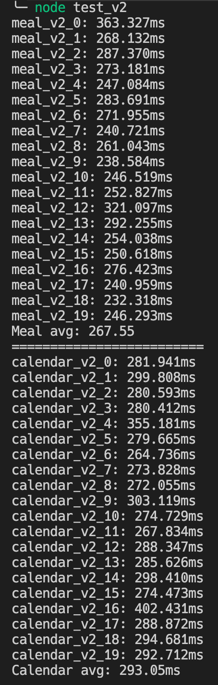

# school-kr

> 전국 초, 등, 고등학교 및 병설유치원 급식, 학사일정 파싱 라이브러리

[](https://www.npmjs.com/package/school-kr)
[](https://www.npmjs.com/package/school-kr)
[](https://www.npmjs.com/package/school-kr)
[](https://circleci.com/gh/leegeunhyeok/school-kr)

본 라이브러리는 `Node.js` 환경에서 사용할 수 있는 Promise 기반의 `급식 API` + `학사일정 API` 통합 라이브러리 입니다.

전국 교육청 학생 서비스 페이지(stu.xxx.go.kr)를 파싱하여 이번 달 **학사일정**과 **급식 정보**를 JSON 데이터로 제공합니다.

`3.0.0` 버전부터 파싱 방식이 아닌 API 호출을 통해 데이터를 수집하여 제공합니다.

## 설치하기

[NPM](https://www.npmjs.com/package/school-kr) 저장소를 통해 다운로드 받을 수 있으며 별다른 작업 없이 바로 사용 가능합니다.

```bash
npm i school-kr
```

## 테스트

아래 명령어를 입력하여 미리 작성된 예제 코드를 실행해볼 수 있습니다.  
`sample/sample.js` 코드가 실행되며, 학교는 `광명경영회계고등학교` 기준으로 실행됩니다.

```bash
npm test
```

`v2` 버전과 `v3` 버전의 성능 비교



---


> v3는 v2 대비 약 25%의 성능이 향상됨 (네트워크 상태에 따라 일부 변동될 수 있음)

테스트 코드는 `test/test_v2.js`, `test/test_v3.js` 참고

## 개발 문서

### School

모듈을 불러오면 School 클래스의 인스턴스를 생성할 수 있습니다.

```javascript
const School = require('school-kr');
new School();
```

---

### School.Type

[학교 종류](#학교-종류) 참조

---

### School.Region

[교육청 관할 지역](#교육청-관할-지역) 참조

---

### (Method) School.search

지정한 지역의 학교를 검색하여 정보를 반환합니다.

| Parameter |  Type  | Required |
| :-------- | :----: | :------: |
| region    | Symbol |    O     |
| name      | string |    O     |

Return type: `Promise<Array<any>>`, [참고](#검색-데이터-형식)

```javascript
const school = new School();
school.search(region, name);
```

예제는 [학교 검색](#학교-검색) 참조

---

### (Method) School.init

인스턴스 정보를 지정한 학교로 초기화 합니다.

| Parameter  |  Type  | Required |
| :--------- | :----: | :------: |
| type       | Symbol |    O     |
| region     | Symbol |    O     |
| schoolCode | string |    O     |

Return type: `void`

```javascript
const school = new School();
school.init(type, region, schoolCode);
```

예제는 [인스턴스 초기화](#인스턴스-초기화) 참조

---

### (Method) School.getMeal

이번 달 또는 지정한 년도/월의 급식 데이터를 반환합니다  
년도 또는 월을 지정하지 않을 경우 **현재 시점의 날짜** 기준의 데이터를 반환합니다.

| Parameter |  Type  | Required |
| :-------- | :----: | :------: |
| year      |  any   |    X     |
| month     | number |    X     |

Return type: `Promise<any>`, [참고](#급식-데이터-형식)

```javascript
school.getMeal(year, month);
```

예제는 [급식 및 학사일정 조회](#급식-및-학사일정-조회) 참조

---

### (Method) School.getCalendar

이번 달 또는 지정한 년도/월의 학사일정 데이터를 반환합니다  
년도 또는 월을 지정하지 않을 경우 **현재 시점의 날짜** 기준의 데이터를 반환합니다.

| Parameter |  Type  | Required |
| :-------- | :----: | :------: |
| year      |  any   |    X     |
| month     | number |    X     |

Return type: `Promise<any>`, [참고](#학사일정-데이터-형식)

```javascript
school.getCalendar(year, month);
```

예제는 [급식 및 학사일정 조회](#급식-및-학사일정-조회) 참조

---

## 사용 방법

### School 인스턴스 생성

`school-kr` 모듈을 불러온 후 인스턴스를 생성합니다.  
생성 후 반드시 `init()`를 호출하여 데이터를 조회할 학교로 초기화합니다.

- init() 호출 없이 데이터를 불러올 경우 Error가 Throw 됩니다.

```javascript
const School = require('school-kr')
const school = new School()

/*
* @param type: 학교 유형(초, 중, 고, 병설유치원)
* @param region: 교육청 관할 지역
* @param schoolCode: 학교 고유 코드
*/
school.init(/* Type */, /* Region */, /* SchoolCode */)
```

#### 학교 종류

학교 종류는 `School.Type` 에서 선택할 수 있습니다.

```javascript
const School = require('school-kr');

/* 4 */
console.log(School.Type.HIGH);
```

|    유형    | Key            | Value |
| :--------: | :------------- | :---: |
| 병설유치원 | `KINDERGARTEN` |   1   |
|  초등학교  | `ELEMENTARY`   |   2   |
|   중학교   | `MIDDLE`       |   3   |
|  고등학교  | `HIGH`         |   4   |

#### 교육청 관할 지역

지역은 생성한 `School.Region` 에서 선택할 수 있습니다.

```javascript
const School = require('school-kr');

/* stu.sen.go.kr */
console.log(School.Region.SEOUL);
```

| 지역 | Key         | Value         |
| :--: | :---------- | :------------ |
| 서울 | `SEOUL`     | stu.sen.go.kr |
| 인천 | `INCHEON`   | stu.ice.go.kr |
| 부산 | `BUSAN`     | stu.pen.go.kr |
| 광주 | `GWANGJU`   | stu.gen.go.kr |
| 대전 | `DAEJEON`   | stu.dge.go.kr |
| 대구 | `DEAGU`     | stu.dge.go.kr |
| 세종 | `SEJONG`    | stu.sje.go.kr |
| 울산 | `ULSAN`     | stu.use.go.kr |
| 경기 | `GYEONGGI`  | stu.goe.go.kr |
| 강원 | `KANGWON`   | stu.kwe.go.kr |
| 충북 | `CHUNGBUK`  | stu.cbe.go.kr |
| 충남 | `CHUNGNAM`  | stu.cne.go.kr |
| 경북 | `GYEONGBUK` | stu.gbe.go.kr |
| 경남 | `GYEONGNAM` | stu.gne.go.kr |
| 전북 | `JEONBUK`   | stu.jbe.go.kr |
| 전남 | `JEONNAM`   | stu.jne.go.kr |
| 제주 | `JEJU`      | stu.jje.go.kr |

## 학교 코드

`School.search()`를 통해 학교 코드를 검색할 수 있습니다.  
자세한 사용법은 [학교 검색](#학교-검색) 참조

## 사용 예시

※ 아래 예제는 경기도의 `광명경영회계고등학교`를 기준으로 진행됩니다.

### 학교 검색

```javascript
const School = require('school-kr');
const school = new School();

school.search(School.Region.GYEONGGI, '광명경영회계고');
```

### 인스턴스 초기화

```javascript
const School = require('school-kr');
const school = new School();

school.init(School.Type.HIGH, School.Region.GYEONGGI, 'J100000488');
```

### 급식 및 학사일정 조회

#### 사용 예시

```javascript
const School = require('school-kr');
const school = new School();

const example = async function () {
  // 학교 검색 및 첫 번째 결과의 학교 코드로 초기화
  const result = await school.search(School.Region.GYEONGGI, '광명경영회계고');
  school.init(School.Type.HIGH, School.Region.GYEONGGI, result[0].schoolCode);

  const meal = await school.getMeal();
  const calendar = await school.getCalendar();

  // 오늘 날짜
  console.log(`${meal.month}월 ${meal.day}일`);

  // 오늘 급식 정보
  console.log(meal.today);

  // 이번 달 급식 정보
  console.log(meal);

  // 이번 달 학사일정
  console.log(calendar);

  // 년도와 달을 지정하여 해당 날짜의 데이터를 조회할 수 있습니다.
  const mealCustom = await school.getMeal(2018, 9);
  const calendarCustom = await school.getCalendar(2017, 4);

  console.log(mealCustom);
  console.log(calendarCustom);

  // 년도값 대신 옵션 객체를 전달하여 데이터 수집 가능
  // year: 년도 (기본값: 현재 시점의 년도)
  // month: 달 (기본값: 현재 시점의 달)
  // default: 급식이 없는 경우 기본값 (기본값: '')
  const optionMeal = await school.getMeal({
    year: 2018,
    month: 9,
    default: '급식이 없습니다',
  });

  // 년도값 대신 옵션 객체를 전달하여 데이터 수집 가능
  // year: 년도 (기본값: 현재 시점의 년도)
  // month: 달 (기본값: 현재 시점의 달)
  // default: 급식이 없는 경우 기본값 (기본값: '')
  // separator: 하루에 2개 이상의 일정이 있는 경우의 구분문자 (기본값: ,)
  //            예: 겨울방학,토요휴업일
  const optionCalendar = await school.getCalendar({
    default: '일정 없는 날',
    separator: '\n',
  });

  console.log(optionMeal);
  console.log(optionCalendar);
};

example();
```

### 검색 데이터 형식

`search` 반환 데이터 형식은 아래와 같습니다.

| Key        |    Value    | 비고      |
| :--------- | :---------: | :-------- |
| name       |   학교명    |           |
| schoolCode |  학교 코드  | NEIS 코드 |
| address    | 학교 소재지 |           |

```javascript
// 경기, 소하 키워드 검색 결과
[
  {
    name: '소하초등학교병설유치원',
    schoolCode: 'J100005055',
    address: '경기도 광명시 소하1동',
  },
  {
    name: '소하초등학교',
    schoolCode: 'J100001213',
    address: '경기도 광명시 소하동',
  },
  { name: '소하중학교', schoolCode: 'J100001194', address: '경기도 광명시 소하동' },
  {
    name: '소하고등학교',
    schoolCode: 'J100000632',
    address: '경기도 광명시 소하1동',
  },
];
```

### 급식 데이터 형식

`getMeal` 반환 데이터 형식은 아래와 같습니다.

| Key    |      Value       | 비고                                              |
| :----- | :--------------: | :------------------------------------------------ |
| 1 ~ 31 | 해당 날짜의 급식 | 급식이 없는 경우 option.default 값 혹은 빈 문자열 |
| year   |    조회 년도     |                                                   |
| month  |     조회 달      |                                                   |
| day    |    오늘 날짜     | 사용자 지정 년도/월이 이번 달이 아닌 경우 0       |
| today  |    오늘 급식     | 급식이 없는 경우 기본 급식 값                     |

```javascript
{
  '1': '[중식]\n발아현미밥\n미역국5.6.9....', // 이번달 1일 메뉴
  '2': '[중식]\n얼갈이된장무침5.6.\n칼슘찹쌀....', // 이번달 2일 메뉴
  '3': '[중식]\n투움바파스타(주식)1.2.5.6.9.13.15.\n....', // 이번달 3일 메뉴
  '4': '', // 급식이 없을 경우 option.default 값 혹은 빈 문자열
  '5': '',
  ...
  'year': 2018, // 이번 년도
  'month': 5,   // 이번 달
  'day': 3,     // 오늘 날짜
  'today': '[중식]\n투움바파스타(주식)1.2.5.6.9.13.15.\n....' // 오늘 메뉴
}
```

### 학사일정 데이터 형식

`getCalendar` 반환 데이터 형식은 아래와 같습니다.

| Key    |      Value       | 비고                                              |
| :----- | :--------------: | :------------------------------------------------ |
| 1 ~ 31 | 해당 날짜의 일정 | 일정이 없는 경우 option.default 값 혹은 빈 문자열 |
| year   |    조회 년도     |                                                   |
| month  |     조회 달      |                                                   |
| day    |    오늘 날짜     | 사용자 지정 년도/월이 이번 달이 아닌 경우 0       |
| today  |    오늘 급식     | 일정이 없는 경우 기본 일정 값                     |

```javascript
{
  '1': '', // 이번 달 1일의 일정
  '2': '', // 일정이 없을 경우 option.default 값 혹은 빈 문자열
  '3': '',
  '4': '개교기념일', // 4일 일정
  '5': '',
  '6': '',
  '7': '대체공휴일',
  ...
  'year': 2018,
  'month': 5 // 이번 달
  'day': 4,  // 오늘 날짜
  'today': '개교기념일' // 오늘의 일정
}
```

## 문제 신고

v3 미만의 버전을 사용하시는 경우 교육청 홈페이지의 리뉴얼 등의 문제로 파싱이 불가능 할 수 있습니다. v3 이상 사용을 권장하며, 문제가 발생할 경우 [이슈](https://github.com/leegeunhyeok/school-kr/issues)를 남겨주시면 최대한 빠르게 수정하여 반영하도록 하겠습니다.

## 변경사항

- `3.1.2`
  - [Issue #26](https://github.com/leegeunhyeok/school-kr/issues/25) 3월 이전의 학사일정을 제대로 불러오지 못하던 문제 수정 - Thanks to [cjaewon](https://github.com/cjaewon)
- `3.1.1`
  - [Issue #19](https://github.com/leegeunhyeok/school-kr/issues/19) 서로 다른 지역의 학교 데이터를 불러올 경우 발생하던 문제 수정 (검색, 급식, 공지 모두 해당함)
  - 개발 의존성 모듈 업데이트
- `3.1.0`
  - [Issue #9](https://github.com/leegeunhyeok/school-kr/issues/9) 세션 관련 로직 개선 (확인 필요)
  - [Issue #16](https://github.com/leegeunhyeok/school-kr/issues/16) 타입스크립트 지원(d.ts 추가) - Thanks to [cjaewon](https://github.com/cjaewon)
  - ESLint 구성 추가 및 코드 스타일 수정
- `3.0.3`
  - [Issue #15](https://github.com/leegeunhyeok/school-kr/issues/15) 모듈을 불러올 수 없던 문제 수정
- `3.0.2`
  - [Issue #11](https://github.com/leegeunhyeok/school-kr/issues/11), [Issue #14](https://github.com/leegeunhyeok/school-kr/issues/14) 1년 이전 데이터가 파싱되던 문제 수정
- `3.0.1`
  - [Issue #10](https://github.com/leegeunhyeok/school-kr/issues/10) 교육청 지역별 세션 유지하도록 수정
- `3.0.0`
  - node-school-kr -> school-kr로 모듈명 변경
  - HTTP 요청 코드를 기존의 request에서 모두 axios로 변경
  - 페이지 HTML 파싱 방식에서 API 데이터 요청 방식으로 변경함에 따라 데이터 수집 성능 개선 - `약 25%`
  - [Issue #2](https://github.com/leegeunhyeok/school-kr/issues/2) 학교 정보(코드) 조회를 위한 search 메소드 추가 - [참고](#method-schoolsearch)
  - [Issue #6](https://github.com/leegeunhyeok/school-kr/issues/6) 1~2월 데이터를 조회할 경우 잘못된 데이터가 나오던 문제 수정 - [참고](https://github.com/leegeunhyeok/school-kr/issues/6#issuecomment-575427817)
  - 3.0.0 부터 사용하지 않음 (Deprecated)
    - `School.reset`
    - `School.getTargetURL`
  - 3.0.0에 맞도록 문서 수정, [Issue #7](https://github.com/leegeunhyeok/school-kr/issues/5) 마크다운 형식 수정
- `2.2.2`
  - [Issue #5](https://github.com/leegeunhyeok/school-kr/issues/5) 대전 교육청 URL 문제 수정
- `2.2.1`
  - [Issue #4](https://github.com/leegeunhyeok/school-kr/issues/4) 학사일정 기본값 오류 수정
- `2.2.0`
  - [Issue #3](https://github.com/leegeunhyeok/school-kr/issues/3) 기본값 옵션 추가
  - `getMeal`, `getCalendar` 옵션 호출방식 추가
- `2.1.2`
  - [Issue #1](https://github.com/leegeunhyeok/school-kr/issues/1) 경북 교육청 접속문제 수정
  - 의존 라이브러리의 보안 취약성 업데이트
- `2.1.1`
  - 의존 라이브러리의 보안 취약성 업데이트
- `2.1.0`
  - 급식 / 학사일정 데이터를 불러올 때 년도와 월을 지정할 수 있도록 기능 추가
  - 급식 / 학사일정 데이터에 년도 추가
  - README에 개발 문서 추가 작성
- `2.0.1`
  - 의존 라이브러리의 보안 취약성 업데이트
- `2.0.0`
  - ※ 기존 버전과 `호환되지 않습니다.` (아래 변경사항을 확인 해주세요)
  - Type, Region 프로퍼티 값을 Symbol 기반으로 구현
    - Type, Region 접근 방식이 조금 변경 됨, [참고1](#학교-종류), [참고2](#교육청-관할-지역)
  - 에러 발생 상황 추가 및 기존 에러 메시지 수정
  - getNotice 메소드명 변경 -> `getCalendar`
  - getTargetURL 메소드 추가 (파싱할 타겟 URL을 반환합니다, [참고](#타겟-URL-조회))
  - 예제 및 README 내용 수정사항에 맞게 업데이트 / 내용 추가
  - 코드 주석 업데이트
- `1.0.1`
  - NPM 저장소와 이름 동일하게 Git 저장소 이름 변경 (이미 사용중인 이름)
    - node-school -> node-school-kr
  - README 문서 내용 수정
  - 에러 메시지 구분 문자 추가 (급식 파싱 에러인지 학사일정 파싱 에러인지 구분)
- `1.0.0` - 첫 번째 릴리즈!

## 라이센스

[MIT](https://github.com/leegeunhyeok/school-kr/blob/master/LICENSE)

## 정보

본 프로젝트는 [School API](https://github.com/agemor/school-api)를 참고하여 Node.js 환경에서 사용할 수 있도록 새로 포팅한 프로젝트입니다.  
`3.0.0` 버전부터 완전히 새롭게 개발되어 성능 및 안정성이 크게 개선되었습니다.
